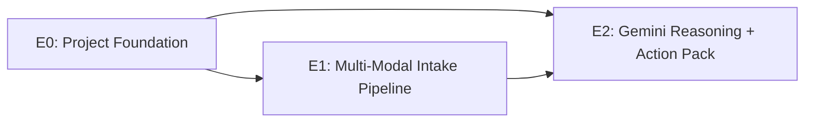
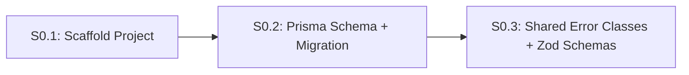
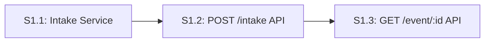
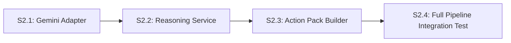
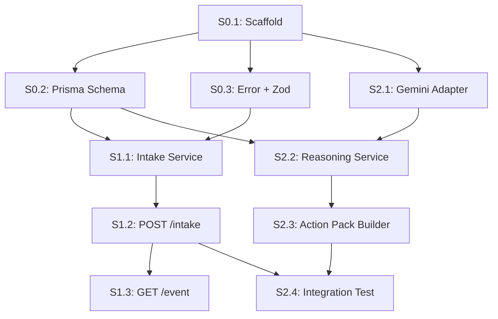

# Product Backlog: AetherBridge (Warm-Up Challenge)

> **Version**: 1.0
> **Date**: 2026-03-28
> **Author**: Auto-generated via Epic & Story Generator Skill
> **Status**: Draft
> **Source SRD**: [docs/srd_aetherbridge.md](file:///c:/Users/kshiteesh/github%20projects/hackathon-warm-up-challenge/docs/srd_aetherbridge.md)
> **Source HLD**: [docs/hld_aetherbridge.md](file:///c:/Users/kshiteesh/github%20projects/hackathon-warm-up-challenge/docs/hld_aetherbridge.md)
> **Source LLD**: [docs/lld_aetherbridge.md](file:///c:/Users/kshiteesh/github%20projects/hackathon-warm-up-challenge/docs/lld_aetherbridge.md)

---

## Backlog Overview

### Scope
This is a **warm-up challenge** backlog. It delivers a focused, end-to-end demo:
**User uploads messy input → Gemini extracts structured intent → User reviews an Action Pack.**

### Epic Map


### Epic Summary
| # | Epic | Stories | Priority | Dependencies | MVP? |
|---|------|---------|----------|-------------|------|
| E0 | Project Foundation | 3 | P0 | None | ✅ |
| E1 | Multi-Modal Intake Pipeline | 3 | P0 | E0 | ✅ |
| E2 | Gemini Reasoning + Action Pack Output | 4 | P0 | E0, E1 | ✅ |

### Milestone Plan
| Milestone | Epics | Deliverable |
|-----------|-------|-------------|
| **MVP** | E0 + E1 + E2 | Working demo: upload voice/photo → get structured Action Pack from Gemini |

---

## E0: Project Foundation

### Epic Overview
| Attribute | Value |
|-----------|-------|
| **Epic ID** | E0 |
| **Title** | Project Foundation |
| **Goal** | Scaffold the project, database, and testing infrastructure. |
| **Business Value** | Every feature depends on a stable foundation with CI-quality test coverage. |
| **Priority** | P0 |
| **Dependencies** | None |

### Story Map


---

### S0.1: Scaffold Next.js + Express Monolith

#### Story Card
| Attribute | Value |
|-----------|-------|
| **Story ID** | S0.1 |
| **Size** | S (2-4 hours) |
| **Component** | All |
| **Layer** | Infrastructure |
| **Depends On** | None |

#### User Story Statement
> **As a** developer,
> **I want to** have a scaffolded monorepo with Next.js frontend and Express backend,
> **So that** I can start building features immediately with a working dev server and test runner.

#### Business Context
Without project scaffolding, no feature can be built or tested. This story creates the DDD folder structure defined in the LLD.

---

#### 🔴 TDD: Tests to Write FIRST (Red Phase)

##### Unit Tests

```typescript
// FILE: src/__tests__/health.test.ts
// FRAMEWORK: Vitest

import { describe, it, expect } from 'vitest';
import request from 'supertest';
import { app } from '../app';

describe('Health Check', () => {

  it('should return 200 OK with status "healthy"', async () => {
    // ACT
    const res = await request(app).get('/api/health');

    // ASSERT
    expect(res.status).toBe(200);
    expect(res.body).toEqual({ status: 'healthy', timestamp: expect.any(String) });
  });

  it('should include the correct Content-Type header', async () => {
    const res = await request(app).get('/api/health');
    expect(res.headers['content-type']).toMatch(/json/);
  });

  it('should return 404 for undefined routes', async () => {
    const res = await request(app).get('/api/nonexistent');
    expect(res.status).toBe(404);
  });

});
```

##### Test Data
| Scenario | Endpoint | Expected Status | Expected Body |
|----------|----------|-----------------|---------------|
| Health check | GET /api/health | 200 | `{ status: "healthy" }` |
| Unknown route | GET /api/xyz | 404 | Error body |

---

#### 🟢 Implementation Guide (Green Phase)

##### What to Build
1. Initialize Next.js project with TypeScript.
2. Create Express API server at `src/app.ts`.
3. Implement DDD folder structure from LLD:
   ```
   src/
   ├── app.ts
   ├── domains/
   │   ├── intake/
   │   ├── reasoning/
   │   ├── verifier/
   │   └── relay/
   ├── infrastructure/
   ├── shared/
   └── api/
       └── routes/
           └── health.ts
   ```
4. Configure Vitest with Supertest.

##### Files to Create
| File | Action | Description |
|------|--------|-------------|
| `src/app.ts` | Create | Express app entry point |
| `src/api/routes/health.ts` | Create | Health check route handler |
| `vitest.config.ts` | Create | Test runner configuration |
| `tsconfig.json` | Create | TypeScript configuration |

---

#### ✅ Definition of Done
- [ ] `npm run dev` starts the dev server
- [ ] `npm run test` runs Vitest successfully
- [ ] Health check tests pass
- [ ] DDD folder structure exists

#### MVP Verification
```bash
npm run test -- src/__tests__/health.test.ts
```

---

### S0.2: Prisma Schema + Database Migration

#### Story Card
| Attribute | Value |
|-----------|-------|
| **Story ID** | S0.2 |
| **Size** | S (2-4 hours) |
| **Component** | Database |
| **Layer** | Database / Repository |
| **Depends On** | S0.1 |
| **LLD Trace** | §3.1 — Prisma Schema |

#### User Story Statement
> **As a** developer,
> **I want to** have the Event and ActionPack database tables ready,
> **So that** the intake and reasoning pipeline can persist structured data.

---

#### 🔴 TDD: Tests to Write FIRST (Red Phase)

```typescript
// FILE: src/domains/intake/__tests__/event.repository.test.ts
// FRAMEWORK: Vitest

import { describe, it, expect, beforeAll, afterAll } from 'vitest';
import { PrismaClient } from '@prisma/client';

const prisma = new PrismaClient();

describe('Event Repository (Prisma)', () => {

  beforeAll(async () => {
    await prisma.$connect();
  });

  afterAll(async () => {
    await prisma.event.deleteMany();
    await prisma.$disconnect();
  });

  it('should create an Event with status PENDING', async () => {
    const event = await prisma.event.create({
      data: {
        rawInputUri: 'gs://test-bucket/test-audio.wav',
        mediaType: 'audio',
        userId: 'user-123',
      },
    });

    expect(event.id).toBeDefined();
    expect(event.status).toBe('PENDING');
    expect(event.version).toBe(1);
  });

  it('should enforce non-null constraint on rawInputUri', async () => {
    await expect(
      prisma.event.create({
        data: { rawInputUri: null as any, mediaType: 'audio', userId: 'user-123' },
      }),
    ).rejects.toThrow();
  });

  it('should create an ActionPack linked to an Event', async () => {
    const event = await prisma.event.create({
      data: { rawInputUri: 'gs://bucket/file.jpg', mediaType: 'photo', userId: 'user-456' },
    });

    const pack = await prisma.actionPack.create({
      data: {
        eventId: event.id,
        intentType: 'MEDICAL',
        payload: { patient: 'Jane Doe', allergies: ['Penicillin'] },
        confidence: 0.95,
      },
    });

    expect(pack.eventId).toBe(event.id);
    expect(pack.isVerified).toBe(false);
  });

});
```

##### Test Data
| Scenario | Input | Expected |
|----------|-------|----------|
| Create Event | Valid URI + mediaType | Event with PENDING status |
| Null URI | `rawInputUri: null` | Prisma constraint error |
| Create ActionPack | Valid eventId + JSON payload | Pack linked to event |

---

#### 🟢 Implementation Guide (Green Phase)

##### Files to Create
| File | Action | Description |
|------|--------|-------------|
| `prisma/schema.prisma` | Create | Full schema from LLD §3.1 |
| `prisma/migrations/` | Generate | `npx prisma migrate dev` |

---

#### ✅ Definition of Done
- [ ] `npx prisma migrate dev` succeeds
- [ ] Repository tests pass against test DB
- [ ] Schema matches LLD §3.1 exactly

---

### S0.3: Shared Error Classes + Zod Validation Schemas

#### Story Card
| Attribute | Value |
|-----------|-------|
| **Story ID** | S0.3 |
| **Size** | S (2-4 hours) |
| **Component** | Shared |
| **Layer** | Service / Utility |
| **Depends On** | S0.1 |
| **LLD Trace** | §7 — Error Handling |

#### User Story Statement
> **As a** developer,
> **I want to** have typed error classes and Zod input schemas,
> **So that** all API inputs are validated at the boundary and errors are consistent.

---

#### 🔴 TDD: Tests to Write FIRST (Red Phase)

```typescript
// FILE: src/shared/__tests__/errors.test.ts
import { describe, it, expect } from 'vitest';
import { AppError, ValidationError, AIProcessingError } from '../errors';

describe('Error Classes', () => {

  it('should create a ValidationError with status 400', () => {
    const err = new ValidationError('Invalid media type');
    expect(err.statusCode).toBe(400);
    expect(err.message).toBe('Invalid media type');
    expect(err).toBeInstanceOf(AppError);
  });

  it('should create an AIProcessingError with status 502', () => {
    const err = new AIProcessingError('Gemini timeout');
    expect(err.statusCode).toBe(502);
    expect(err.code).toBe('AI_PROCESSING_ERROR');
  });

});
```

```typescript
// FILE: src/shared/__tests__/schemas.test.ts
import { describe, it, expect } from 'vitest';
import { IntakeMetadataSchema } from '../schemas';

describe('Zod Schemas', () => {

  it('should validate correct intake metadata', () => {
    const result = IntakeMetadataSchema.safeParse({
      type: 'audio',
      context: 'Patient coughing heavily',
    });
    expect(result.success).toBe(true);
  });

  it('should reject invalid media type', () => {
    const result = IntakeMetadataSchema.safeParse({
      type: 'hologram',
    });
    expect(result.success).toBe(false);
  });

  it('should allow optional context field', () => {
    const result = IntakeMetadataSchema.safeParse({ type: 'photo' });
    expect(result.success).toBe(true);
  });

});
```

---

#### 🟢 Implementation Guide (Green Phase)

##### Files to Create
| File | Action | Description |
|------|--------|-------------|
| `src/shared/errors.ts` | Create | AppError, ValidationError, AIProcessingError, ConcurrencyError |
| `src/shared/schemas.ts` | Create | Zod schemas: IntakeMetadataSchema, ActionPackPayloadSchema |

---

#### ✅ Definition of Done
- [ ] All error class tests pass
- [ ] All Zod schema tests pass
- [ ] Errors map to LLD §7 taxonomy

---

## E1: Multi-Modal Intake Pipeline

### Epic Overview
| Attribute | Value |
|-----------|-------|
| **Epic ID** | E1 |
| **Title** | Multi-Modal Intake Pipeline |
| **Goal** | Accept media uploads (audio/photo/video), persist to storage, and create an Event record. |
| **SRD Reference** | §4.1 — Multi-Modal Intake |
| **HLD Components** | Ingestion Hub, GCS Media Vault |
| **Priority** | P0 |
| **Dependencies** | E0 |

### Story Map


---

### S1.1: Intake Service (Business Logic)

#### Story Card
| Attribute | Value |
|-----------|-------|
| **Story ID** | S1.1 |
| **Size** | M (4-8 hours) |
| **Component** | Intake Domain |
| **Layer** | Service |
| **Depends On** | S0.2, S0.3 |

#### User Story Statement
> **As a** responder,
> **I want to** upload a voice recording or photo,
> **So that** it is safely stored and a trackable Event is created in the system.

---

#### 🔴 TDD: Tests to Write FIRST (Red Phase)

```typescript
// FILE: src/domains/intake/__tests__/intake.service.test.ts
import { describe, it, expect, vi } from 'vitest';
import { IntakeService } from '../intake.service';

// Mock dependencies
const mockStorageAdapter = {
  uploadFile: vi.fn().mockResolvedValue('gs://aether-vault/test-file.wav'),
};
const mockPrisma = {
  event: {
    create: vi.fn().mockResolvedValue({
      id: 'evt-001',
      rawInputUri: 'gs://aether-vault/test-file.wav',
      mediaType: 'audio',
      status: 'PENDING',
      userId: 'user-123',
    }),
  },
};

const service = new IntakeService(mockStorageAdapter as any, mockPrisma as any);

describe('IntakeService', () => {

  describe('processUpload', () => {

    it('should upload file to storage and create a PENDING event', async () => {
      const result = await service.processUpload({
        file: Buffer.from('fake-audio-data'),
        mimeType: 'audio/wav',
        userId: 'user-123',
        context: 'Patient intake recording',
      });

      expect(mockStorageAdapter.uploadFile).toHaveBeenCalledOnce();
      expect(mockPrisma.event.create).toHaveBeenCalledWith(
        expect.objectContaining({
          data: expect.objectContaining({
            status: 'PENDING',
            userId: 'user-123',
          }),
        }),
      );
      expect(result.eventId).toBe('evt-001');
      expect(result.status).toBe('PENDING');
    });

    it('should throw ValidationError if file buffer is empty', async () => {
      await expect(
        service.processUpload({
          file: Buffer.alloc(0),
          mimeType: 'audio/wav',
          userId: 'user-123',
        }),
      ).rejects.toThrow('File cannot be empty');
    });

    it('should throw ValidationError for unsupported MIME types', async () => {
      await expect(
        service.processUpload({
          file: Buffer.from('data'),
          mimeType: 'application/exe',
          userId: 'user-123',
        }),
      ).rejects.toThrow('Unsupported media type');
    });

  });

});
```

##### Test Data
| Scenario | Input | Expected |
|----------|-------|----------|
| Valid audio upload | Buffer + `audio/wav` | Event `{ status: PENDING }` |
| Empty file | `Buffer.alloc(0)` | `ValidationError` |
| Bad MIME type | `application/exe` | `ValidationError` |

---

#### 🟢 Implementation Guide (Green Phase)

##### Files to Create
| File | Action | Description |
|------|--------|-------------|
| `src/domains/intake/intake.service.ts` | Create | `processUpload()` method |
| `src/infrastructure/storage.adapter.ts` | Create | GCS upload wrapper (mockable) |

---

#### ✅ Definition of Done
- [ ] All 3 unit tests pass
- [ ] Service validates MIME types: `audio/*`, `image/*`, `video/*`
- [ ] Storage adapter is injected (not hardcoded)

---

### S1.2: POST /api/v1/intake Endpoint

#### Story Card
| Attribute | Value |
|-----------|-------|
| **Story ID** | S1.2 |
| **Size** | M (4-8 hours) |
| **Component** | API |
| **Layer** | Controller |
| **Depends On** | S1.1 |
| **LLD Trace** | §4.1 — POST /intake |

#### User Story Statement
> **As a** frontend client,
> **I want to** POST media to `/api/v1/intake`,
> **So that** I receive a tracking `event_id` with a `202 Accepted` status.

---

#### 🔴 TDD: Tests to Write FIRST (Red Phase)

```typescript
// FILE: src/api/__tests__/intake.controller.test.ts
import { describe, it, expect } from 'vitest';
import request from 'supertest';
import { app } from '../../app';

describe('POST /api/v1/intake', () => {

  it('should return 202 with event_id for valid upload', async () => {
    const res = await request(app)
      .post('/api/v1/intake')
      .attach('media', Buffer.from('fake-audio'), 'recording.wav')
      .field('metadata', JSON.stringify({ type: 'audio' }));

    expect(res.status).toBe(202);
    expect(res.body.event_id).toBeDefined();
    expect(res.body.status).toBe('PROCESSING');
  });

  it('should return 400 if no media file is attached', async () => {
    const res = await request(app)
      .post('/api/v1/intake')
      .field('metadata', JSON.stringify({ type: 'audio' }));

    expect(res.status).toBe(400);
    expect(res.body.error.code).toBe('VALIDATION_ERROR');
  });

  it('should return 400 if metadata has invalid type', async () => {
    const res = await request(app)
      .post('/api/v1/intake')
      .attach('media', Buffer.from('data'), 'file.xyz')
      .field('metadata', JSON.stringify({ type: 'hologram' }));

    expect(res.status).toBe(400);
  });

});
```

---

#### 🟢 Implementation Guide (Green Phase)

##### Files to Create
| File | Action | Description |
|------|--------|-------------|
| `src/api/routes/intake.ts` | Create | Express route + multer middleware |
| `src/api/middleware/errorHandler.ts` | Create | Catches AppError, returns JSON |

---

#### ✅ Definition of Done
- [ ] All 3 controller tests pass
- [ ] Multer accepts multipart file uploads
- [ ] Zod validates the `metadata` field
- [ ] Returns `202 Accepted` with `event_id`

---

### S1.3: GET /api/v1/event/:id Endpoint

#### Story Card
| Attribute | Value |
|-----------|-------|
| **Story ID** | S1.3 |
| **Size** | S (2-4 hours) |
| **Component** | API |
| **Layer** | Controller |
| **Depends On** | S1.2 |
| **LLD Trace** | §4.2 — GET /event/:id |

---

#### 🔴 TDD: Tests to Write FIRST (Red Phase)

```typescript
// FILE: src/api/__tests__/event.controller.test.ts
import { describe, it, expect } from 'vitest';
import request from 'supertest';
import { app } from '../../app';

describe('GET /api/v1/event/:id', () => {

  it('should return 200 with event status and action packs', async () => {
    // ARRANGE: Seed a test event in DB first
    const res = await request(app).get('/api/v1/event/evt-seeded-001');

    expect(res.status).toBe(200);
    expect(res.body.id).toBe('evt-seeded-001');
    expect(res.body.status).toBeDefined();
    expect(res.body.action_packs).toBeInstanceOf(Array);
  });

  it('should return 404 for non-existent event', async () => {
    const res = await request(app).get('/api/v1/event/non-existent-id');
    expect(res.status).toBe(404);
    expect(res.body.error.code).toBe('NOT_FOUND');
  });

});
```

---

#### 🟢 Implementation Guide (Green Phase)

| File | Action | Description |
|------|--------|-------------|
| `src/api/routes/event.ts` | Create | GET handler with Prisma findUnique |

---

#### ✅ Definition of Done
- [ ] Both tests pass
- [ ] Returns full event with nested `action_packs`
- [ ] Returns 404 with correct error shape for missing events

---

## E2: Gemini Reasoning + Action Pack Output

### Epic Overview
| Attribute | Value |
|-----------|-------|
| **Epic ID** | E2 |
| **Title** | Gemini Reasoning + Action Pack Output |
| **Goal** | Process uploaded media through Vertex AI Gemini to extract structured intent and entities, then output an Action Pack. |
| **SRD Reference** | §4.2 — Gemini Reasoner, §4.3 — Verification Sandbox |
| **HLD Components** | Context Orchestrator, Verification Sandbox |
| **Priority** | P0 |
| **Dependencies** | E0, E1 |

### Story Map


---

### S2.1: Vertex AI (Gemini) Adapter

#### Story Card
| Attribute | Value |
|-----------|-------|
| **Story ID** | S2.1 |
| **Size** | M (4-8 hours) |
| **Component** | Reasoning Domain |
| **Layer** | Infrastructure / Adapter |
| **Depends On** | S0.1 |

#### User Story Statement
> **As the** reasoning engine,
> **I want to** send a multi-modal prompt (text + GCS URI) to Gemini 1.5 Pro,
> **So that** I receive a structured JSON extraction of intent and entities.

---

#### 🔴 TDD: Tests to Write FIRST (Red Phase)

```typescript
// FILE: src/infrastructure/__tests__/gemini.adapter.test.ts
import { describe, it, expect, vi } from 'vitest';
import { GeminiAdapter } from '../gemini.adapter';

// Mock the Vertex AI SDK
const mockGenerateContent = vi.fn();

describe('GeminiAdapter', () => {

  const adapter = new GeminiAdapter({ generateContent: mockGenerateContent } as any);

  it('should return structured JSON from Gemini response', async () => {
    mockGenerateContent.mockResolvedValue({
      response: {
        text: () => JSON.stringify({
          intent: 'MEDICAL_TRIAGE',
          entities: { patient_name: 'John', allergies: ['Sulfites'] },
          confidence: 0.97,
        }),
      },
    });

    const result = await adapter.extractIntent('gs://bucket/audio.wav', 'audio/wav');

    expect(result.intent).toBe('MEDICAL_TRIAGE');
    expect(result.entities.patient_name).toBe('John');
    expect(result.confidence).toBeGreaterThan(0.9);
  });

  it('should throw AIProcessingError if Gemini returns malformed JSON', async () => {
    mockGenerateContent.mockResolvedValue({
      response: { text: () => 'This is not JSON at all' },
    });

    await expect(
      adapter.extractIntent('gs://bucket/file.wav', 'audio/wav'),
    ).rejects.toThrow('AI_PROCESSING_ERROR');
  });

  it('should throw AIProcessingError on Gemini SDK timeout', async () => {
    mockGenerateContent.mockRejectedValue(new Error('DEADLINE_EXCEEDED'));

    await expect(
      adapter.extractIntent('gs://bucket/file.wav', 'audio/wav'),
    ).rejects.toThrow('AI_PROCESSING_ERROR');
  });

});
```

##### Test Data
| Scenario | Gemini Response | Expected |
|----------|----------------|----------|
| Valid JSON | `{ intent: "SOS", ... }` | Parsed object |
| Malformed text | `"Not JSON"` | `AIProcessingError` |
| Timeout | SDK throws | `AIProcessingError` |

---

#### 🟢 Implementation Guide (Green Phase)

| File | Action | Description |
|------|--------|-------------|
| `src/infrastructure/gemini.adapter.ts` | Create | Wraps `@google-cloud/vertexai`, sends prompt, parses JSON |

---

#### ✅ Definition of Done
- [ ] All 3 tests pass
- [ ] Adapter is fully mockable (SDK injected via constructor)
- [ ] Handles and wraps all Gemini errors cleanly

---

### S2.2: Reasoning Service (Orchestrator)

#### Story Card
| Attribute | Value |
|-----------|-------|
| **Story ID** | S2.2 |
| **Size** | M (4-8 hours) |
| **Component** | Reasoning Domain |
| **Layer** | Service |
| **Depends On** | S2.1, S0.2 |

#### User Story Statement
> **As the** system,
> **I want to** orchestrate the full reasoning loop (fetch Event → call Gemini → save ActionPack → update status),
> **So that** a user's messy input is converted into a reviewable Action Pack.

---

#### 🔴 TDD: Tests to Write FIRST (Red Phase)

```typescript
// FILE: src/domains/reasoning/__tests__/reasoning.service.test.ts
import { describe, it, expect, vi } from 'vitest';
import { ReasoningService } from '../reasoning.service';

const mockGeminiAdapter = {
  extractIntent: vi.fn().mockResolvedValue({
    intent: 'SOS',
    entities: { location: '37.7749, -122.4194', severity: 'HIGH' },
    confidence: 0.99,
  }),
};

const mockPrisma = {
  event: {
    findUnique: vi.fn().mockResolvedValue({
      id: 'evt-001',
      rawInputUri: 'gs://bucket/sos.mp4',
      mediaType: 'video',
      status: 'PENDING',
    }),
    update: vi.fn().mockResolvedValue({ id: 'evt-001', status: 'READY_FOR_REVIEW' }),
  },
  actionPack: {
    create: vi.fn().mockResolvedValue({
      id: 'ap-001',
      intentType: 'SOS',
      confidence: 0.99,
    }),
  },
};

const service = new ReasoningService(mockGeminiAdapter as any, mockPrisma as any);

describe('ReasoningService', () => {

  describe('processEvent', () => {

    it('should call Gemini, create ActionPack, and update Event to READY_FOR_REVIEW', async () => {
      const result = await service.processEvent('evt-001');

      expect(mockGeminiAdapter.extractIntent).toHaveBeenCalledWith(
        'gs://bucket/sos.mp4', 'video',
      );
      expect(mockPrisma.actionPack.create).toHaveBeenCalledWith(
        expect.objectContaining({
          data: expect.objectContaining({ intentType: 'SOS', confidence: 0.99 }),
        }),
      );
      expect(mockPrisma.event.update).toHaveBeenCalledWith(
        expect.objectContaining({
          data: expect.objectContaining({ status: 'READY_FOR_REVIEW' }),
        }),
      );
      expect(result.actionPackId).toBe('ap-001');
    });

    it('should set Event status to FAILED if Gemini throws', async () => {
      mockGeminiAdapter.extractIntent.mockRejectedValueOnce(new Error('AI_PROCESSING_ERROR'));
      mockPrisma.event.update.mockResolvedValueOnce({ id: 'evt-001', status: 'FAILED' });

      await expect(service.processEvent('evt-001')).rejects.toThrow();

      expect(mockPrisma.event.update).toHaveBeenCalledWith(
        expect.objectContaining({
          data: expect.objectContaining({ status: 'FAILED' }),
        }),
      );
    });

    it('should throw NotFoundError if event does not exist', async () => {
      mockPrisma.event.findUnique.mockResolvedValueOnce(null);
      await expect(service.processEvent('ghost-event')).rejects.toThrow('NOT_FOUND');
    });

  });

});
```

---

#### 🟢 Implementation Guide (Green Phase)

| File | Action | Description |
|------|--------|-------------|
| `src/domains/reasoning/reasoning.service.ts` | Create | Orchestrates: find event → call adapter → persist ActionPack → update status |

---

#### ✅ Definition of Done
- [ ] All 3 tests pass
- [ ] Event status transitions are correct: `PENDING → PROCESSING → READY_FOR_REVIEW` (or `FAILED`)
- [ ] Error handling follows LLD §7 taxonomy

---

### S2.3: Action Pack Builder (JSON Output)

#### Story Card
| Attribute | Value |
|-----------|-------|
| **Story ID** | S2.3 |
| **Size** | S (2-4 hours) |
| **Component** | Reasoning Domain |
| **Layer** | Service / Utility |
| **Depends On** | S2.2 |

#### User Story Statement
> **As the** Action Relay module,
> **I want to** receive a standardized Action Pack JSON object,
> **So that** it can be forwarded to any legacy system (EHR, Dispatch) without transformation.

---

#### 🔴 TDD: Tests to Write FIRST (Red Phase)

```typescript
// FILE: src/domains/reasoning/__tests__/action-pack.builder.test.ts
import { describe, it, expect } from 'vitest';
import { ActionPackBuilder } from '../action-pack.builder';

describe('ActionPackBuilder', () => {

  it('should build a valid Action Pack JSON from raw Gemini output', () => {
    const raw = {
      intent: 'MEDICAL_TRIAGE',
      entities: { patient_name: 'Jane Doe', allergies: ['Penicillin'] },
      confidence: 0.98,
    };

    const pack = ActionPackBuilder.build('evt-001', raw);

    expect(pack.event_id).toBe('evt-001');
    expect(pack.intent).toBe('MEDICAL_TRIAGE');
    expect(pack.entities.patient_name).toBe('Jane Doe');
    expect(pack.verification.status).toBe('PENDING');
  });

  it('should flag low-confidence packs as REQUIRES_REVIEW', () => {
    const raw = { intent: 'UNKNOWN', entities: {}, confidence: 0.4 };
    const pack = ActionPackBuilder.build('evt-002', raw);

    expect(pack.verification.status).toBe('REQUIRES_REVIEW');
  });

  it('should throw if intent is missing from Gemini output', () => {
    expect(() =>
      ActionPackBuilder.build('evt-003', { entities: {}, confidence: 0.5 } as any),
    ).toThrow('Intent is required');
  });

});
```

---

#### 🟢 Implementation Guide (Green Phase)

| File | Action | Description |
|------|--------|-------------|
| `src/domains/reasoning/action-pack.builder.ts` | Create | Static `build()` method, applies confidence thresholds |

---

#### ✅ Definition of Done
- [ ] All 3 tests pass
- [ ] Confidence threshold: `>= 0.85 → VERIFIED`, `< 0.85 → REQUIRES_REVIEW`
- [ ] Output matches LLD §4.2 Action Pack schema

---

### S2.4: Full Pipeline Integration Test

#### Story Card
| Attribute | Value |
|-----------|-------|
| **Story ID** | S2.4 |
| **Size** | M (4-8 hours) |
| **Component** | All |
| **Layer** | Integration |
| **Depends On** | S1.2, S2.2, S2.3 |

#### User Story Statement
> **As a** QA engineer,
> **I want to** run a single end-to-end test from media upload to Action Pack output,
> **So that** I can verify the entire "Chaos-to-Action" pipeline works.

---

#### 🔴 TDD: Tests to Write FIRST (Red Phase)

```typescript
// FILE: src/__tests__/pipeline.integration.test.ts
import { describe, it, expect } from 'vitest';
import request from 'supertest';
import { app } from '../app';

describe('Full Pipeline: Upload → Reason → Action Pack', () => {

  it('should process an audio upload end-to-end and return an Action Pack', async () => {
    // STEP 1: Upload
    const uploadRes = await request(app)
      .post('/api/v1/intake')
      .attach('media', Buffer.from('fake-audio-sos'), 'sos.wav')
      .field('metadata', JSON.stringify({ type: 'audio', context: 'SOS call' }));

    expect(uploadRes.status).toBe(202);
    const eventId = uploadRes.body.event_id;

    // STEP 2: Allow processing (in real: wait for async; in test: trigger manually)
    // This may require a test helper to trigger reasoning synchronously

    // STEP 3: Check result
    const eventRes = await request(app).get(`/api/v1/event/${eventId}`);

    expect(eventRes.status).toBe(200);
    expect(eventRes.body.status).toBe('READY_FOR_REVIEW');
    expect(eventRes.body.action_packs.length).toBeGreaterThan(0);
    expect(eventRes.body.action_packs[0].intent).toBeDefined();
  });

});
```

---

#### 🟢 Implementation Guide (Green Phase)

##### What to Build
1. Wire the Intake controller to trigger `ReasoningService.processEvent()` after successful upload.
2. Ensure the GET `/event/:id` endpoint returns nested `action_packs`.

---

#### ✅ Definition of Done
- [ ] Integration test passes end-to-end
- [ ] Upload → Reason → Action Pack flow completes in < 10 seconds (test environment)
- [ ] Event status transitions correctly through the full lifecycle

---

## Dependency Graph (All Stories)


