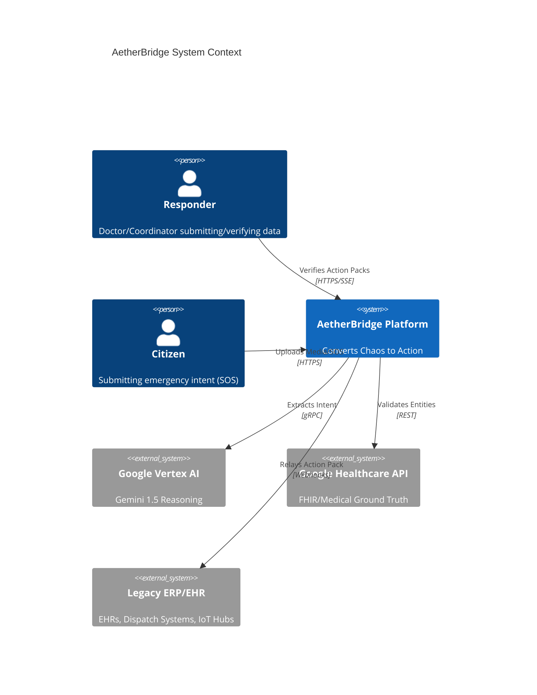
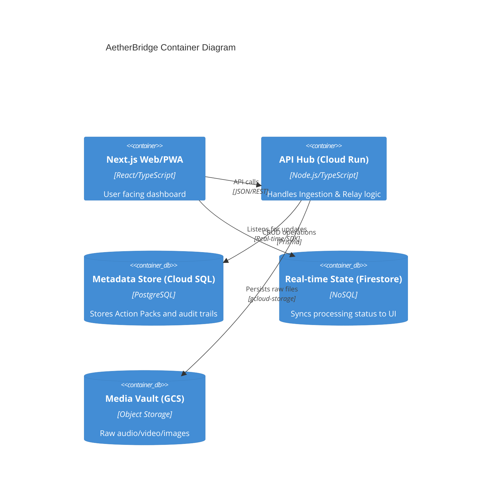

# High-Level Design: AetherBridge

> **Version**: 1.0
> **Date**: 2026-03-28
> **Author**: Auto-generated via System Design Skill
> **Status**: Draft
> **Source SRD**: [docs/srd_aetherbridge.md](file:///c:/Users/kshiteesh/github%20projects/hackathon-warm-up-challenge/docs/srd_aetherbridge.md)

---

## 1. Executive Summary

### 1.1 Purpose
This document provides the architectural blueprint for **AetherBridge**, mapping the technical requirements into a robust, high-availability system design. It is intended for architects and tech leads to understand the system's structural boundaries and interaction patterns.

### 1.2 System Overview
AetherBridge is a multi-modal translation engine that processes chaotic real-world inputs (voice, photos, video) through Gemini 1.5 Pro to generate structured "Action Packs." These packs are verified against authoritative ground-truth sources and relayed to legacy systems (EHRs, Dispatch, Utility APIs). The system targets a 99.99% SLA for life-critical actions.

### 1.3 Design Principles
- **Safety First**: Every AI-generated intent must pass through a Human-in-the-Loop (HITL) or a 100%-confidence Verification Sandbox.
- **Eventual Consistency is NOT OK**: All medical/emergency entities must maintain strong consistency in the primary relational store.
- **Asynchronous Intake / Real-time Output**: Optimize for background media processing while pushing results to the UI via SSE/Firestore.
- **Modular Boundaries**: Maintain strict DDD boundaries to allow future Microservices decomposition.

---

## 2. Architecture Overview

### 2.1 Architecture Pattern: Modular Monolith
To meet the <3s latency goals and minimize operational complexity for v1, AetherBridge uses a **Modular Monolith**. 
- **Justification**: Avoids network overhead between the reasoner and verifier. Utilizes Shared-Nothing modules (internal domain isolation) for maintainability.

### 2.2 System Context Diagram
Shows AetherBridge as a unified platform interacting with external actors (Responders/Citizens) and third-party systems.



### 2.3 Container Diagram
Detailed look into the containers running on GCP.



---

## 3. Component Architecture

### 3.1 Gemini Reasoner Module
- **Purpose**: Translates multi-modal input to structured schema.
- **Responsibility**: Prompt engineering, multi-modal context assembly, and initial JSON structuring.
- **Scaling**: Horizontal scaling via Cloud Run (concurrency-based).

### 3.2 Verification Sandbox Module
- **Purpose**: Validates extracted entities against Ground Truth.
- **Responsibility**: Mapping "Gemini Entities" to "Database Canonical Entities" (e.g., mapping "Aspirin" verbal extraction to a standard RxNorm ID).
- **Latency Requirement**: <500ms lookup.

---

## 4. Data Architecture

### 4.1 Data Store Decisions
| Data Type | Store | Justification | Consistency |
|-----------|-------|--------------|-------------|
| **Core Entities** | PostgreSQL | Relational integrity for Life/Death actions. | Strong |
| **Media Metadata** | PostgreSQL | Fast querying of event history. | Strong |
| **Real-time Status**| Firestore | Sub-second sync to mobile/PWA dashboards. | Eventual (Causal) |
| **Raw Artifacts** | GCS | Scalable, high-throughput blob storage. | Strongly Consistent (on write) |

### 4.2 Data Flow Architecture: Ingestion to Relay
1. User uploads Media -> **API Hub** -> **GCS**.
2. **API Hub** creates `Event` record in **PostgreSQL** and status in **Firestore**.
3. **API Hub** sends GCS URI + Prompt to **Vertex AI**.
4. **Vertex AI** returns JSON.
5. **Verification Sandbox** runs cross-checks against **Ground Truth APIs**.
6. **Action Pack** is finalized and pushed to **Firestore** for Frontend "Review" state.

---

## 5. Security Architecture

### 5.1 Trust Boundaries
```mermaid
flowchart TD
    subgraph Public_Internet
        UserApp[Mobile/PWA]
    end
    subgraph AetherBridge_VPC
        LB[Cloud Load Balancer]
        API[API Hub - Cloud Run]
        PG[PostgreSQL DB]
    end
    subgraph High_Security_Zone
        DLP[Sensitive Info Masking]
        Secrets[GCP Secrets Manager]
    end

    UserApp --HTTPS/TLS1.3--> LB
    LB --> API
    API --> DLP
    API --IAM-- > PG
```

### 5.2 PII Lifecycle
- **Step 1**: Raw input stored in a "Locked Vault" GCS bucket.
- **Step 2**: Vertex DLP API scans extracted entities.
- **Step 3**: Metadata store only keeps "Anonymized" or "Masked" records if user opts out of long-term storage.

---

## 6. Infrastructure & Reliability

### 6.1 Deployment Topology
- **Regional Deployment**: Deployed in `us-central1` and `europe-west1` for jurisdictional data residency.
- **Failover**: Global Load Balancer redirects traffic if a region's Cloud Run instance goes down.

### 6.2 Disaster Recovery
- **Sync-on-Reconnect**: API uses local storage on PWA/Mobile to queue uploads during network drops.
- **Backup Strategy**: Daily snapshots of PostgreSQL;Firestore GAE daily exports.

---

## 7. Architecture Decision Records (ADRs)

### ADR-001: Firestore for Status Sync
- **Status**: Accepted.
- **Decision**: Use Firebase/Firestore for real-time processing updates instead of WebSockets.
- **Rationale**: Firestore handles connection reconnects and offline state natively, which is critical for responders in moving vehicles or disaster areas.

---

## 8. Architecture Evaluation Dimensions (Quality Gates)
Architecture decisions dynamically map to and enforce the 6 Evaluation Dimensions:
- **Code Quality**: Modular Monolith design strictly limits file coupling, providing a clear path for independent module testing and high code reusability.
- **Security**: IAM-restricted GCS Vaults, OIDC flow with Cloud Run, and Data Loss Prevention limits security exposure footprints.
- **Efficiency**: Background processing of media in GCP and pushing only lightweight status events to Firestore minimizes network payload drops and compute overhead.
- **Testing**: Decoupled APIs ensure 90%+ unit testability across layers, allowing the verification sandbox to be reliably mocked.
- **Accessibility**: Eventual delivery to Next.js/PWA enables full WCAG 2.1 AA compliance UI scaffolding natively using standard React ARIA.
- **Google Services**: Direct and deep embedding of GCP ecosystem—Cloud Run, Vertex AI, GCS, Secret Manager, Cloud SQL, Firestore—for highly managed serverless orchestration.

---

## 9. Capacity Estimation

### 9.1 Storage (1-Year)
- **Metadata**: 1 Million events/year @ 1KB/record = 1GB.
- **Media**: 1 Million events @ 5MB avg = **5 TB**. (Retention policy: 90 days default).

### 9.2 Compute
- **Throughput**: Target 1,000 concurrent Gemini reasoning sessions during peak disaster events. Cloud Run concurrency set to 80 per instance.
