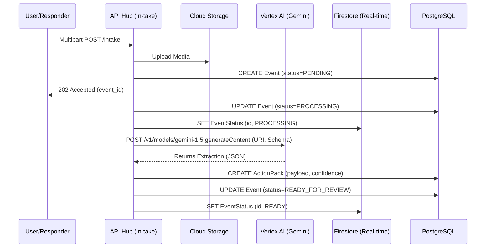
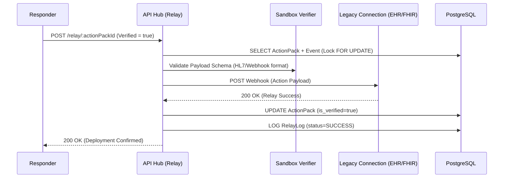

# Low-Level Design: AetherBridge

> **Version**: 1.0
> **Date**: 2026-03-28
> **Author**: Auto-generated via System Design Skill
> **Status**: Draft
> **Source HLD**: [docs/hld_aetherbridge.md](file:///c:/Users/kshiteesh/github%20projects/hackathon-warm-up-challenge/docs/hld_aetherbridge.md)
> **Source SRD**: [docs/srd_aetherbridge.md](file:///c:/Users/kshiteesh/github%20projects/hackathon-warm-up-challenge/docs/srd_aetherbridge.md)

---

## 1. Introduction

### 1.1 Purpose
This document provides the internal implementation blueprint for **AetherBridge**. It specifies exact class interfaces, database schemas, and data flow sequences for the engineering team.

### 1.2 Conventions
- **Naming**: `snake_case` for database columns, `camelCase` for TypeScript, `PascalCase` for Classes/Models.
- **Validation**: All inputs must be validated via **Zod** at the API boundary.
- **Errors**: Standard `AppError` base class for bubbling up to 4xx/5xx responses.

---

## 2. Project Structure

### 2.1 Domain-Driven Design (DDD) Layout
AetherBridge uses a Modular Monolith folder structure to enforce domain boundaries.

```
src/
├── app/                  # Application-wide orchestration
├── domains/              # Core business logic
│   ├── intake/           # Media ingestion and GCS management
│   ├── reasoning/        # Vertex AI (Gemini) orchestration
│   ├── verifier/         # Ground Truth verification logic
│   └── relay/            # Outbound integration logic
├── infrastructure/       # External service adapters (Prisma, GCS, Firestore)
├── shared/               # Reusable types, Zod schemas, errors
└── api/                  # Express controllers and middleware
```

---

## 3. Detailed Database Design

### 3.1 Persistence Layer (PostgreSQL/Prisma)
The database stores structured "Intent" and "Action Packs."

#### Schema (Prisma DDL)
```prisma
model Event {
  id           String      @id @default(uuid())
  rawInputUri  String      // GCS URI
  mediaType    String      // "audio", "video", "photo"
  status       EventStatus @default(PENDING)
  userId       String
  actionPacks  ActionPack[]
  createdAt    DateTime    @default(now())
  updatedAt    DateTime    @updatedAt
  version      Int         @default(1) // Optimistic Locking
}

model ActionPack {
  id             String      @id @default(uuid())
  eventId        String
  event          Event       @relation(fields: [eventId], references: [id])
  intentType     String      // "MEDICAL", "SOS", "UTILITY"
  payload        Json        // The structured action data
  confidence     Float
  isVerified     Boolean     @default(false)
  verifiedById   String?
  relayLogs      RelayLog[]
}

enum EventStatus {
  PENDING
  PROCESSING
  READY_FOR_REVIEW
  RELAYED
  FAILED
}
```

#### Indexing Strategy
- `idx_event_user_id`: To list events by the submitting responder.
- `idx_action_pack_event_id`: To find generated packs for an intake session.

---

## 4. API Design (AetherBridge API v1)

### 4.1 POST /api/v1/intake
**Description**: Submits media for multi-modal reasoning.
**Auth**: Required (Bearer JWT).

**Request Body (Multipart)**:
- `media`: File (Blob)
- `metadata`: JSON (`{ "type": "audio/video/photo", "context": "optional context" }`)

**Response — 202 Accepted**:
```json
{
  "event_id": "uuid-v4",
  "status": "PROCESSING",
  "tracking_url": "/api/v1/event/uuid-v4"
}
```

### 4.2 GET /api/v1/event/:id
**Description**: Returns current Processing-to-ActionPack status.
**Auth**: Required.

**Response — 200 OK**:
```json
{
  "id": "uuid",
  "status": "READY_FOR_REVIEW",
  "action_packs": [
    {
      "id": "uuid",
      "intent": "MEDICAL_TRIAGE",
      "payload": { "name": "...", "priority": "High" },
      "is_verified": false
    }
  ]
}
```

---

## 5. Sequence Diagram: Ingestion Pipeline

Detailed flow from "Messy Input" to "Ready for Review."



---

## 6. Sequence Diagram: Action Relay

Ensures data reaches the legacy system safely via Human-in-the-Loop (HITL).



---

## 7. Error Handling & Retry Policies

### 7.1 Error Taxonomy
- `AppError`
  - `ValidationError`: Zod parse failure (HTTP 400).
  - `ConcurrencyError`: Optimistic lock conflict (HTTP 409).
  - `AIProcessingError`: Gemini timeout or refusal (HTTP 502).
  - `ConnectivityError`: GCS or DB unreachable (HTTP 503).

### 7.2 Retry Strategy: "The Relay Rule"
To maintain 99.99% reliability during network drops:
1. **Frontend Retry**: Exponential backoff for file uploads.
2. **Relay Retry**: If a Legacy Webhook fails, the Record remains in `READY_FOR_REVIEW`.
3. **Queue**: Unsent Action Packs are processed by a background worker every 10 minutes.

---

## 8. Class / Interface Design

```typescript
/**
 * @interface IReasoningEngine
 * Manages the prompt-to-extraction loop with Vertex AI.
 */
interface IReasoningEngine {
  processMedia(gcsUri: string, mimeType: string): Promise<ActionPackDraft>;
  applyDomainHeuristics(draft: ActionPackDraft): ActionPackDraft;
}

/**
 * @interface IRelayConnector
 * Generic adapter for different outbound providers (FHIR, Webhook, IoT).
 */
interface IRelayConnector {
  sendAction(payload: ActionPackPayload): Promise<RelayResult>;
  validatePayload(payload: any): boolean;
}
```

---

## 9. Automated Quality & Evaluation Tooling
To enforce the 98% quality gates defined in the SRD, the CI/CD and engineering workflow utilizes these prescribed and automated checks:

### 9.1 Code Quality Tooling
- **Linting & Formatting**: `ESLint` (strict + recommended ruleset) and `Prettier` checked pre-commit.
- **Types**: `tsc --noEmit` with `strict: true`. No implicit `any` permitted without explicit overrides.
- **Complexity Guard**: `madge --circular` (blocks circular dependencies) and enforce max file line-count of <300 locally.

### 9.2 Security Tooling
- **Dependencies Audit**: Automated `npm audit` blocking on Critical/High.
- **Secret Scanning**: `gitleaks` deployed as a mandatory pre-commit hook and Github Action.
- **Run-time Checks**: Validation strictly routed out to `Zod`. Headers managed via `Helmet.js` configuration.

### 9.3 Efficiency Tooling
- **Bundle & UI**: `size-limit` limiting initial bundle sizes <200KB. Lighthouse CI gates.
- **Data Insights**: Enforce pagination query limiters. Query plans parsed via `EXPLAIN ANALYZE` logs against Postgres/Prisma.

### 9.4 Testing Tooling
- **Runner**: `Vitest` or `Jest` orchestrated to achieve strict ≥90% line and ≥85% branch coverage constraints natively mapped into CI.
- **Mocking**: Dedicated HTTP mocking endpoints for Google Healthcare API and Vertex via mock server (MSW).

### 9.5 Accessibility Tooling
- **Library**: `axe-core` integrated into Playwright instances to fail E2E tests on any structural ARIA or WCAG AA errors.
