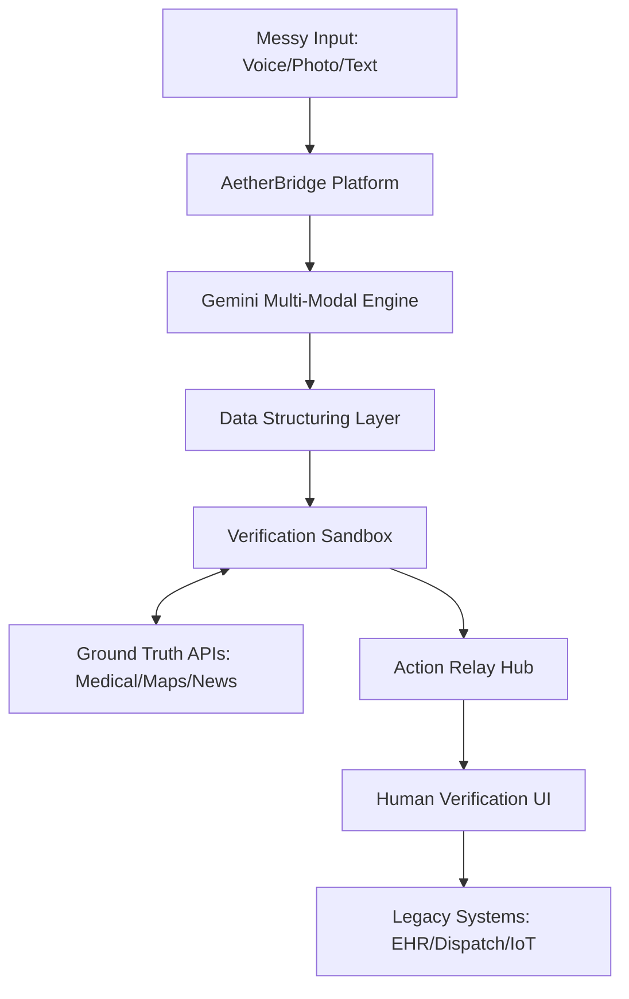

# Product Requirements Document: AetherBridge

> **Version**: 1.0
> **Date**: 2026-03-28
> **Author**: Auto-generated via PRD Generator Skill
> **Status**: Draft

---

## Table of Contents
1. [Product Overview](#1-product-overview)
2. [Vision and Goals](#2-vision-and-goals)
3. [Target Audience](#3-target-audience)
4. [Key Features and Functional Requirements](#4-key-features-and-functional-requirements)
5. [Non-Functional Requirements](#5-non-functional-requirements)
6. [User Journeys](#6-user-journeys)
7. [Assumptions and Constraints](#7-assumptions-and-constraints)
8. [Future Roadmap](#8-future-roadmap)
9. [Glossary](#9-glossary)
10. [Appendix](#10-appendix)

---

## 1. Product Overview

### 1.1 Problem Statement
In high-stakes environments—emergency medicine, natural disasters, and urban crisis response—valuable "intent" is often lost or delayed due to **data friction**. Critical information is currently trapped in unstructured, "messy" formats: frantic voice memos, handwritten intake notes, grainy photos, or complex medical histories. 

Today, professional responders and citizens spend precious minutes manually "cleaning" this data to trigger action in rigid legacy systems (EHRs, dispatch software, utility grids). This delay costs lives, destroys property, and causes systemic burnout.

### 1.2 Product Description
**AetherBridge** is a Gemini-powered "Universal Bridge" that instantly translates human intent from real-world chaos into verified, structured, and life-saving actions. Using Gemini's advanced multi-modal long-context reasoning, AetherBridge acts as a translation layer that accepts *any* input (voice, photo, video, text) and outputs a precise, interoperable "Action Pack" ready for legacy system integration.

Key differentiators:
- **True Multi-modality**: Processes video, sound, and visual data simultaneously to contextually understand intent.
- **Verification First**: Unlike generic LLMs, it grounds every insight in expert-vetted knowledge bases (medical, legal, safety) before recommending actions.
- **Action-Oriented**: It doesn't just "summarize"—it constructs the JSON payloads required to *act* in real systems.

### 1.3 Scope
**In Scope for v1.0:**
- Multi-modal input hub (Audio, Photo, Document Scan).
- Gemini-powered extraction of Intent, Entities, and Severity.
- Integration with Ground Truth APIs (Medical, Mapping, Disaster Data).
- "Action Relay" to 3 primary legacy categories: Healthcare (EHR), Emergency Services (Dispatch), and Utility Infrastructure.
- Human-in-the-Loop (HITL) verification board.

**Out of Scope for v1.0:**
- Automated control of hardware/robotics.
- Full "Self-Service" citizen-to-citizen marketplace.
- Large-scale historical data analytics platform.
- Real-time video-stream processing (v1 focuses on "asynchronous" media captures like photos/clips).

---

## 2. Vision and Goals

### 2.1 Product Vision
To be the global "interfacing layer" between human need and systemic response, ensuring that no life-saving intent is ever lost to administrative complexity or technical barriers.

### 2.2 Strategic Goals
| Goal | Description | Success Indicator | Priority |
|------|-------------|-------------------|----------|
| **Intent-to-Action Speed** | Minimize the time from "messy input" to "structured action." | < 5s processing for complex inputs. | Critical |
| **High-Fidelity Structuring** | Ensure zero loss of critical entities (names, meds, locations). | 99% accuracy in entity extraction. | Critical |
| **Ground Truth Verification** | AI outputs must be cross-referenced with verified datasets. | 0% unverified "high-stakes" actions. | High |
| **Legacy Compatibility** | Ease of integration with 30+ year old backend systems. | < 1 day developer onboarding for new integrations. | Medium |

### 2.3 Success Metrics & KPIs
| Metric | Target | Measurement Method | Timeframe |
|--------|--------|--------------------|-----------|
| **Response Time Reduction** | 40% faster than manual data entry. | Comparative A/B testing with responders. | Q3 2026 |
| **User Onboarding** | < 1 hour to master "Action Relay." | Training completion logs. | Q4 2026 |
| **Accuracy Rate** | > 99% for life-critical fields. | Manual audit vs. AI output. | Continuous |

---

## 3. Target Audience

### 3.1 User Personas
- **Dr. Amara — Rural ER Physician**: Working in under-resourced clinics with high patient volume. Needs to "dump" messy intakes and verbal histories into a system that automatically flags red alerts and updates digital records.
- **Commander Chen — Disaster Coordinator**: Managing chaotic "messy" reports from 1,000s of citizens during a fire or flood. Needs a unified, structured dashboard of verified SOS signals to deploy resources efficiently.
- **Citizen Leo — Distressed User**: Someone in an active emergency who doesn't have time to navigate menus. Needs a "Hold and Speak" interface that understands their intent even during panic.

### 3.2 User Segments
- **Primary**: Emergency Responders (Medical, Fire, Police), Infrastructure Crews (Power, Water, Road).
- **Secondary**: Citizens in High-Risk Zones, Urban Planners, Humanitarian Aid NGOs.
- **Operational**: System Administrators at Municipal/Hospital levels.

---

## 4. Key Features and Functional Requirements

### 4.1 Multi-Modal Intake (MMI)
#### Description
A unified "Capture Hub" designed for high-stress use. It accepts voice recordings, photos of documents/scenes, and short video clips.

#### User Stories
| ID | As a... | I want to... | So that... | Priority | Acceptance Criteria |
|----|---------|-------------|------------|----------|---------------------|
| US-MMI-001 | Responded | Snap a photo of a messy medical chart | It's instantly digitized | Must | Clear extraction of all handwritten fields. |
| US-MMI-002 | Citizen | Record a voice memo of my emergency | I don't have to type | Must | Accuracy in speech-to-intent regardless of background noise. |

---

### 4.2 Gemini Reasoner & Structuring Engine
#### Description
The "brain" of AetherBridge. It utilizes Gemini's multi-modal capabilities to reason across inputs (e.g., "The user sounds distressed AND the photo shows a Type 3 structural collapse").

#### Functional Requirements
| ID | Requirement | Description | Priority |
|----|-------------|-------------|----------|
| FR-RE-001 | Intent Extraction | Identify the "Main Action" requested (e.g., "Send Ambulance"). | Must |
| FR-RE-002 | Entity Recognition | Label GPS, names, medications, and hazard types. | Must |
| FR-RE-003 | Multi-Modal Fusion | Correlate audio and visual signals to resolve ambiguity. | High |

---

### 4.3 Verification Sandbox
#### Description
A layer that validates Gemini's output against "Ground Truth" APIs. If a medication name is extracted, it is cross-referenced with a medical database before being "actioned."

#### Business Rules
- **Rule 1**: Any "Life-Critical" action (e.g., dispatching help) requires a 100% match with a Ground Truth entity or Human Verification.
- **Rule 2**: Ambiguous data must be flagged with a "Confidence Score."

---

### 4.4 Action Relay (Integrations)
#### Description
Connects structured data to legacy systems via Webhooks, HL7/FHIR (Medical), and custom APIs.

#### Functional Requirements
| ID | Requirement | Description | Priority |
|----|-------------|-------------|----------|
| FR-AR-001 | JSON Generation | Output standardized Action Packs for third-party consumption. | Must |
| FR-AR-002 | Human-in-the-Loop Gateway | Provide a UI for a supervisor to "Approve" an Action Pack before sending. | Must |

---

## 5. Non-Functional Requirements

### 5.1 UI/UX Design System
- **Philosophy**: "Stress-First Design." High readability and accessibility.
- **Visuals**: Dark Mode by default (reduce glare), High Contrast (WCAG 2.1 AAA), Large touch targets for gloved hands.
- **Branding**: Professional, "Stable Blue," and Clean San-Serif typography (Inter).

### 5.2 Performance & SLAs
| Metric | Requirement | Measurement |
|--------|------------|-------------|
| **Input Analysis** | < 3 Seconds | Time from upload to structured draft. |
| **API Latency** | < 500ms | Interaction feedback speed. |
| **Availability** | 99.99% | Uptime for "Life-Saving" Tier. |

### 5.3 Security
- **Data Handling**: HIPAA, SOC2, and GDPR compliant. 
- **Privacy**: Zero-knowledge encryption for PII (Personally Identifiable Information). PII is stripped before being sent for "General Training" of secondary models.
- **Authentication**: MFA/Biometric required for all professional users.

---

## 6. User Journeys

### 6.1 Medical Triage Journey
- **Scenario**: Dr. Amara receives a patient with a "messy" history (verbal accounts, loose papers).
- **Steps**:
    1. Dr. Amara records 30s of the patient speaking and snaps 2 photos of old prescriptions.
    2. AetherBridge fusion-checks the audio and photos.
    3. System identifies a "Sulfite Allergy" mentioned only in the audio.
    4. System prepares a "Red Flag" Action Pack for the hospital's EHR.
- **Success Criteria**: EHR is updated with correctly categorized allergies and medications within 10 seconds.

### 6.2 Disaster SOS Journey
- **Scenario**: Citizen Leo is trapped in a flood.
- **Steps**:
    1. Leo shouts "Water is at the attic level!" into the AetherBridge app and points the camera out the window.
    2. Gemini identifies the "Life Threat Level: High" and GPS via the video metadata.
    3. Action Relay sends a structured SOS ticket to Dispatch Commander Chen.
- **Success Criteria**: Rescue crew receives precise GPS and "Attic Level" context without needing a follow-up call.

---

## 7. Assumptions and Constraints

### 7.1 Assumptions
- Stable (or intermittent) internet connectivity in priority zones.
- Access to high-quality Gemini 1.5 Pro/Flash models.
- Legal indemnity for AI-suggested actions provided humans remain in the loop.

### 7.2 Constraints
- **Timeline**: MVP within 6 months.
- **Technology**: Must run on low-end smartphones.
- **Regulatory**: Must pass medical device/safety software certifications in target regions.

---

## 8. Future Roadmap

### Phase 2 (Next Release)
| Feature | Description | Priority |
|---------|-------------|----------|
| **Real-Time Video Stream** | AR-overlay for responders showing extracted data in real-time. | High |
| **Citizen-to-Citizen Mesh** | Enable AetherBridge logic to work offline via Bluetooth/Mesh. | Medium |

### Phase 3+ (Long-term Vision)
- Integration with autonomous drones for "Instant Dispatch."
- Expansion into Daily Productivity (Legal, Finance, Personal Life Chaos).

---

## 9. Glossary
| Term | Definition |
|------|-----------|
| **Action Pack** | A standardized JSON object containing Intent, Entities, and Ground-Truth verification tags. |
| **MMI** | Multi-Modal Intake (The UI component for capturing data). |
| **HITL** | Human-in-the-Loop (Mandatory verification step for critical actions). |

---

## 10. Appendix

### System Context Diagram

