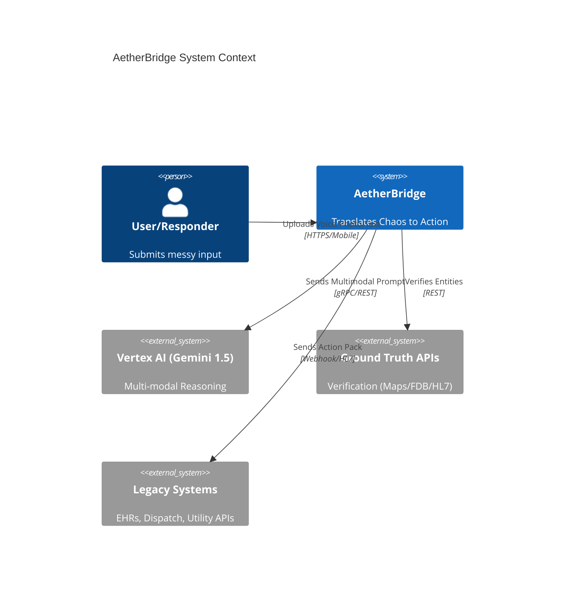
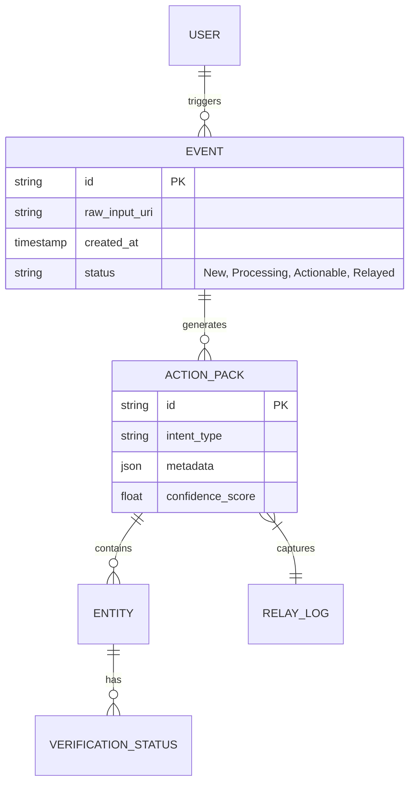
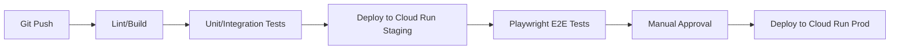

# Software Requirements Document: AetherBridge

> **Version**: 1.0
> **Date**: 2026-03-28
> **Author**: Auto-generated via SRD Generator Skill
> **Status**: Draft
> **Source PRD**: [docs/prd_aetherbridge.md](file:///c:/Users/kshiteesh/github%20projects/hackathon-warm-up-challenge/docs/prd_aetherbridge.md)

---

## Table of Contents
1. [Introduction](#1-introduction)
2. [Technical Architecture](#2-technical-architecture)
3. [Data Architecture](#3-data-architecture)
4. [API Specifications](#4-api-specifications)
5. [Security Architecture](#5-security-architecture)
6. [Reliability & Operations](#6-reliability--operations)
7. [Testing Strategy](#7-testing-strategy)
8. [Performance Engineering](#8-performance-engineering)
9. [Release & Deployment](#9-release--deployment)
10. [Risk Assessment](#10-risk-assessment)
11. [Accessibility & Inclusivity](#11-accessibility--inclusivity)
12. [Quality Gates & Metrics](#12-quality-gates--metrics)
13. [Glossary](#13-glossary)
14. [Appendix](#14-appendix)

---

## 1. Introduction

### 1.1 Purpose
This SRD defines the technical implementation of **AetherBridge**, bridging the product requirements of "chaos-to-action" translation into actionable engineering specifications. It serves as the primary technical baseline for developers, DevOps, and Security teams.

### 1.2 Scope
- **Included**: Multi-modal ingestion pipeline, Vertex AI (Gemini) orchestration, Action Pack generation, and Relay connectors.
- **Excluded**: Legacy system internal maintenance (AetherBridge only sends data *to* them), and edge-device hardware drivers.

### 1.3 PRD Cross-Reference
| PRD Section | SRD Coverage | Notes |
|-------------|-------------|-------|
| 4.1 Multi-Modal Intake | Section 2.2, 4.2 | Media processing pipeline |
| 4.2 Gemini Reasoner | Section 2.2, 5.2 | Vertex AI integration |
| 4.3 Verification Sandbox | Section 3.1, 4.4 | Ground Truth API mapping |
| 4.4 Action Relay | Section 4.2 | Outbound relay connectors |

---

## 2. Technical Architecture

### 2.1 Architecture Overview
AetherBridge utilizes a **Modular Monolith** pattern deployed on **Google Cloud Platform (GCP)**. This pattern is chosen for rapid iteration in v1 while maintaining strict module boundaries for the Reasoner and the Relay to support a future microservices split if needed.

> [!TIP]
> **Cloud-Native Recommendation**: Deploying on GCP Cloud Run (Serverless) allows for zero-scaling during downtime and automatic burst-scaling during regional crises/disasters.

#### System Context Diagram


### 2.2 Component Architecture
- **Ingestion Hub**: Handles multipart upload/streaming for audio/video to GCS.
- **Context Orchestrator**: Wraps user input into structured Gemini prompts with RAG-based domain knowledge.
- **Relay Dispatcher**: Manages outbound "Action Pack" state and retry logic (Sync-on-Reconnect).

### 2.3 Technology Stack
| Layer | Technology | Version | Justification |
|-------|-----------|---------|---------------|
| **Frontend** | Next.js (TypeScript) | 14+ | SSR for dashboard, PWA for mobile. |
| **Backend** | Node.js / Express | 20+ | Fast development, extensive middleware for auth/GCP. |
| **Database** | PostgreSQL + Prisma | 15+ | Relational integrity for "Action Pack" entities. |
| **Media Store** | Google Cloud Storage | - | Durable blob storage for messy inputs. |
| **Real-time** | Firebase Firestore | - | Real-time state sync between MMI and Relay. |
| **AI/ML** | Vertex AI (Gemini 1.5 Pro) | - | Native multi-modal reasoning. |

---

## 3. Data Architecture

### 3.1 Data Model
AetherBridge uses a hybrid store: **PostgreSQL** for relational "Action Packs" and **Firestore** for real-time lifecycle tracking of emergency events.

#### ER Diagram


### 3.2 Database Design: Action Packs
| Field | Type | Constraints | Description |
|-------|------|-------------|-------------|
| id | UUID | PK | Unique action identifier. |
| event_id | UUID | FK | Reference to the raw intake event. |
| intent | VARCHAR(50) | NOT NULL | "Medical_Triage", "SOS", "Infrastructure_Issue". |
| payload | JSONB | NOT NULL | The structured data for legacy systems. |
| confirmed | BOOLEAN | DEFAULT FALSE | HITL (Human-in-the-loop) flag. |

---

## 4. API Specifications

### 4.1 API Design Principles
- **RESTful** standard for public and relay APIs.
- **Versioning**: Header-based `v1`.
- **Latency Target**: p99 < 500ms for metadata operations.

### 4.2 API Endpoints

#### Intake Management
| Method | Endpoint | Description | Auth |
|--------|----------|-------------|------|
| POST | `/api/v1/intake` | Upload file/voice metadata to trigger Gemini reasoning. | Yes |
| GET | `/api/v1/event/:id` | Get status and extracted Action Packs. | Yes |

#### Relay Execution
| Method | Endpoint | Description | Auth |
|--------|----------|-------------|------|
| POST | `/api/v1/relay/:id` | Finalize and send data to legacy connector. | Yes (Admin) |

#### [Action Pack Example]
```json
{
  "event_id": "98b5-0e2d",
  "intent": "Medical_Emergency",
  "entities": {
    "patient_name": "John Doe",
    "allergies": ["Penicillin", "Sulfites"],
    "medications": ["Lipitor"]
  },
  "verification": {
    "ground_truth_source": "Google Healthcare API",
    "match_found": true
  }
}
```

---

## 5. Security Architecture

### 5.1 Authentication
- **Provider**: Firebase Authentication.
- **Flow**: OIDC/JWT.
- **MFA**: Mandatory for Professional (Responder/Doctor) personas.

### 5.2 Data Security
- **Encryption**: AES-256 for data at rest (Cloud KMS). TLS 1.3 for data in transit.
- **PII Stripping**: Automated "Data Loss Prevention" (DLP) layer using Google DLP API to mask names/SSNs in logs.

> [!CAUTION]
> **PII Storage**: Raw media (audio/photos) containing PHI must be stored in a HIPAA-compliant GCS bucket with 30-day auto-deletion policies.

---

## 6. Reliability & Operations

### 6.1 Availability Design
- **Multi-Zone**: Deploy Cloud Run services across multiple zones in the chosen region.
- **RTO/RPO**: 
    - RTO: 15 minutes (Regional failover).
    - RPO: 5 minutes (Postgres Point-in-Time recovery).

### 6.2 Monitoring & Observability
- **Tooling**: Google Cloud Monitoring + Error Reporting.
- **Alerts**: Notify `on-call` if `Relay_Failure_Rate > 1%` over a 5-minute window.

---

## 7. Testing Strategy

### 7.1 Test Pyramid
| Level | Coverage Target | Tools | Responsibility |
|-------|----------------|-------|----------------|
| **Unit** | 90% | Jest / Vitest | Developer |
| **Integration** | 70% | Supertest | Developer |
| **E2E** | 100% Critical Paths | Playwright | QA |
| **Security** | OWASP Top 10 | Snyk / OWASP ZAP | Security |

> [!IMPORTANT]
> **Life-Saving Journeys**: Automation tests for the "Disaster SOS" and "Medical Triage" flows must pass with 100% success rate in CI before any deployment to Production.

---

## 8. Performance Engineering

### 8.1 Performance Budgets
- **First Response (TTI)**: Multi-modal processing start < 500ms.
- **Total Ingestion Loop**: < 5s for an "Action Pack" to be ready for review.

---

## 9. Release & Deployment

### 9.1 CI/CD Pipeline


### 9.2 Milestone Plan
1. **Milestone 1 (Alpha)**: Multi-modal upload + basic Gemini Intent extraction.
2. **Milestone 2 (Beta)**: Ground Truth API integration + HITL UI.
3. **Milestone 3 (GA)**: Full Relay Connectors (FHIR/Webhook) + Security Compliance audit.

---

## 10. Risk Assessment

| Risk | Likelihood | Impact | Mitigation |
|------|-----------|--------|------------|
| **Gemini Hallucination** | Med | High | Verification Sandbox + Mandatory HITL check. |
| **API Rate Limits** | Low | High | Queue-based processing for massive disaster events. |
| **Regulatory Delay** | Med | Med | Modular architecture to swap specific compliance modules per region. |

---

## 11. Accessibility & Inclusivity

### 11.1 Standards Compliance
- **WCAG Target**: WCAG 2.1 AA Compliance for all frontend interfaces.
- **Device Agnostic**: Fully responsive from mobile (320px) to desktop (1920px). Keyboard navigable UI.
- **Assistive Technologies**: Screen reader support and proper ARIA traits for all real-time event updates.

---

## 12. Quality Gates & Metrics

### 12.1 Evaluation Framework Integration
All project deliverables must conform to a strict **98% Evaluation Quality Gate** spanning the following 6 dimensions:
1. **Code Quality**: Enforced via ESLint/Prettier and strict typing. No long lines/files.
2. **Security**: Zero critical/high vulnerabilities. Complete PII protection.
3. **Efficiency**: Adherence to performance budgets defined in Section 8.
4. **Testing**: Enforce 90% unit test line-coverage and 85% branch-coverage. E2E testing for critical paths.
5. **Accessibility**: 100% pass on axe-core automated audits (WCAG AA).
6. **Google Services**: Meaningful utilization of Vertex AI, GCS, Cloud Run, and Firestore following GCP standards.

---

## 13. Glossary
- **FHIR**: Fast Healthcare Interoperability Resources.
- **Cloud Run**: Managed serverless compute platform on GCP.
- **Action Pack**: The technical unit of exchange for "processed intent."

---

## 14. Appendix

### 14.1 Reference Architecture Diagram
[Detailed flowchart for Media Pipeline and Vertex AI interaction to be added in dev-docs.]
